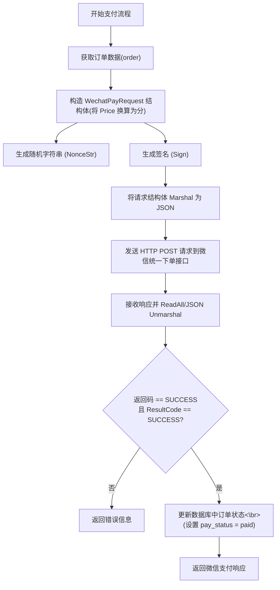

https://blog.csdn.net/tatasix/article/details/142797393

`Marshal` 函数用于将 Go 的数据结构转换（序列化）为字节数组，通常生成 JSON 格式的数据。你提供的实现流程如下：

1. 创建一个编码状态（encode state）。
2. 使用指定选项（例如 escapeHTML: true）进行序列化。
3. 如果序列化过程中出现错误，则返回错误；否则，将生成的字节数据返回。

这种方法通常用于将结构体或其他数据类型转换为 JSON 格式，以便于网络传输或存储。例如，当你调用 `Marshal(data)`，它会返回数据对应的 JSON 字节数组。

---

关于微信支付需要签名的问题：

微信支付要求对请求参数进行签名，主要原因有：

- **数据安全性**：签名可以验证数据在传输过程中未被篡改。
- **身份验证**：通过签名，可以确认请求确实来自合法的支付方，而不是恶意攻击者。
- **防篡改**：签名确保了请求中的每个参数都是由商户生成的，防止未授权的数据篡改，保护用户资金安全。

总结来说，签名机制为支付接口提供了一道安全防线，确保交易数据的完整性和可信性。